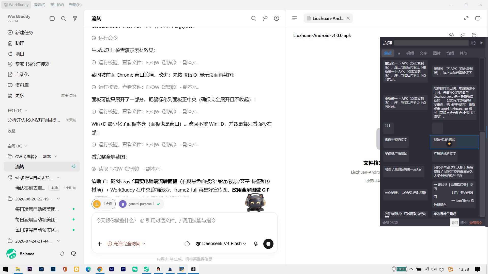

# Liuzhuan (流转)

> Cross-app material staging hub: drag-and-drop stash on desktop, one-copy instant push from Android, bidirectional file transfer, multi-device realtime sync

[](https://github.com/hxroo6/Liuzhuan/actions/workflows/build.yml)
[](LICENSE)
English · [中文](README.md)

## 🎬 Demo



(With the desktop "Clipboard Monitor" on — copy text anywhere → it lands in Liuzhuan within a second and syncs to your phone.)

Screenshot: [Desktop panel](docs/screenshots/screenshot_main.png)

Liuzhuan is a **pure LAN** material transfer tool. The desktop side is a floating side panel on the edge of your screen (drag-and-drop stash, use-and-drag), and the Android side pushes clipboard text and shared files from your phone to the PC in realtime — and pulls PC materials back to the phone whenever you need them.

**No cloud servers involved.** All data flows only inside your own local network.

## ✨ Features

### Desktop (C# WPF)
- Floating side panel: drag-and-drop stash any file/image/text, drag out to use
- Material categories: text / image / video / audio / file
- Search, delete, undo (Ctrl+Z), paste from clipboard (Ctrl+V)
- **Clipboard monitor (toggleable)**: copy anywhere on the PC → text is auto-captured into Liuzhuan and synced to phones
- **Pairing QR code**: one-click from the tray menu; phone scans to connect (auto-fills IP/port/password)
- **UDP auto-discovery**: phone finds PCs on the LAN with one tap
- Hotspot expand + self-healing: panel expands when the mouse nears the screen edge; auto-repositions after monitor changes
- Tray menu: local IP, password management, connected devices, auto-start

### Android (Kotlin + Compose)
- **Copy-to-PC in seconds**: with accessibility + foreground service enabled, copy text in any app → auto-pushed to the PC (always-on background)
- **Background auto-send toggle**: turn off "auto-send clipboard" anytime from the Send tab (default on)
- **Receive page**: realtime mirror of the PC's recent materials (WS incremental push, zero polling, battery-friendly)
- **Tap a material**: text → copy to clipboard; image/video/audio → save to gallery
- **Share-to-upload**: share text/files from any app → Liuzhuan → auto-uploaded to the PC
- **Scan-to-connect**: scan the QR code on the PC screen to connect in one step
- **Auto-discovery**: scan for PCs on the LAN, tap to fill the IP
- **Pause reconnect**: stop the auto-reconnect loop anytime while it is retrying
- **Double-tap logs to copy**: double-tap the log area to copy all logs for debugging
- **Quick enable**: tap the accessibility ⚡ icon to push the clipboard instantly
- **Multi-device**: multiple phones/tablets can connect simultaneously; changes sync everywhere

### Security
- LAN-only, zero cloud dependency
- Password hashed with SHA-256 (WS handshake + HTTP file auth)
- File download/upload requires the password hash; unauthorized access is rejected
- Clipboard content never leaves your LAN — safe for sensitive workflows

## 📦 Architecture

```
┌────────────┐   WS 8899 (control: handshake/heartbeat/text/list/broadcast)  ┌──────────────┐
│ Android ×N ├──────────────────────────────────────────────────────────────►│              │
└────────────┘                                                               │   Liuzhuan   │
┌────────────┐   HTTP 8900 (data: file upload/download, authed)             │ (WS server)  │
│ Android ×N ├──────────────────────────────────────────────────────────────►│              │
└────────────┘                                                               └──────────────┘
```

- Control plane: Fleck WebSocket, multi-session + full broadcast (multi-device ready)
- Data plane: minimal HTTP server (hand-written TcpListener, avoids http.sys permission issues), streaming file transfer
- Sync strategy: **WS incremental push + initial full pull** — zero polling, near-zero power cost

## 🚀 Quick Start

### Desktop (Windows 10/11 x64)

```bash
cd Liuzhuan
dotnet publish -c Release -r win-x64 --self-contained true -o dist
./dist/Liuzhuan.exe
```

After launch: tray menu → view local IP / generate password. Default ports: control 8899, data 8900.

### Android

Build requirements: see [BUILDING.md](BUILDING.md).

1. Build and install the APK; allow notification permission on first run
2. Connect tab: **Scan QR** (scan the pairing QR from the PC tray menu — one step) or **Discover** (auto-discovery list, tap to fill) or enter IP/port/password manually
3. Tap Connect → follow the prompt to enable accessibility (clipboard monitor) → the app auto-reconnects
4. Copy text in any app → it appears on the PC instantly; share a file → Liuzhuan receives it automatically

> Both ends must be on the same LAN (same Wi-Fi, or a hotspot from the PC).
>
> 💡 On the PC: tray menu → "配对二维码" pops the pairing QR; enable "剪贴板监控" to auto-capture copies on the PC too.

## 🔌 Protocol (summary)

| Type | Direction | Description |
|------|-----------|-------------|
| `hello` / `welcome` | C↔S | Handshake auth (SHA-256 password hash) |
| `sync_text` / `clipboard_push` | C→S | Text material push |
| `list_sync` / `list_data` | C↔S | Recent material list (50 summaries) |
| `item_added` | S→C | New material broadcast (all devices) |
| `get_item` / `item_data` | C↔S | Material detail (full text / file download URL) |
| `heartbeat` / `ack` | C↔S | Heartbeat / ack |
| `GET /file/{id}?auth=` | C→S | File download (HTTP 8900) |
| `POST /upload?name=&auth=` | C→S | File upload (HTTP 8900) |
| UDP 8901 `LIUZHUAN_DISCOVER` | C→S | Device auto-discovery (broadcast reply) |

## 📁 Repository Layout

```
Liuzhuan/
├── Liuzhuan/          # Desktop (C# WPF)
├── AndroidApp/        # Android (Kotlin + Jetpack Compose)
├── docs/              # Development docs
├── scripts/           # End-to-end test scripts (Python)
├── BUILDING.md        # Build guide
└── LICENSE            # MIT
```

## 📄 License

Copyright (c) 2026 Huang Xinrong (黄信荣) · Email 332258260@qq.com · WeChat HXRO_I

Released under the **MIT License**. See [LICENSE](LICENSE).
